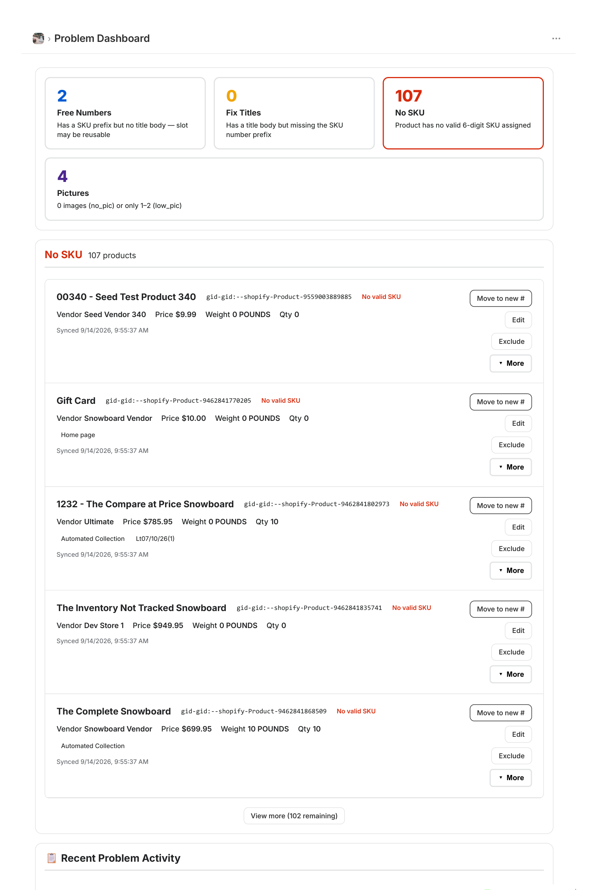
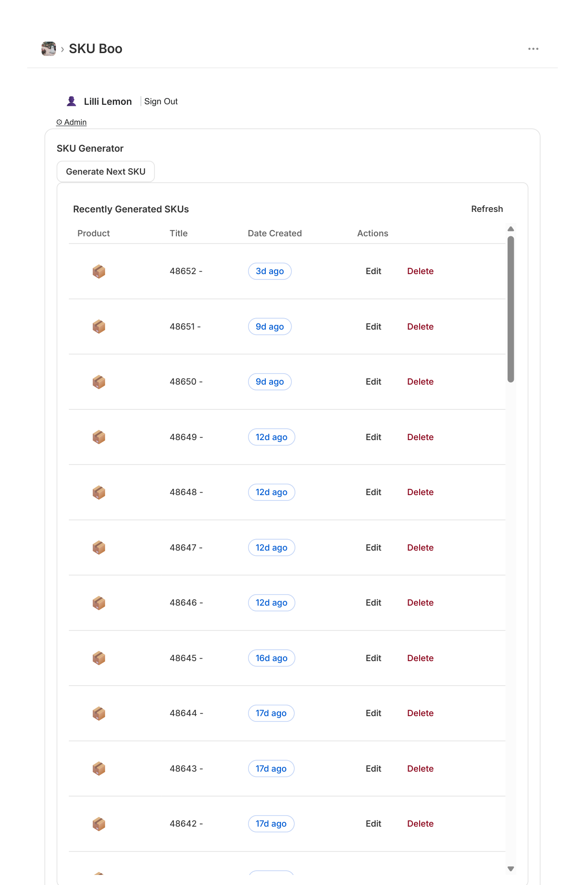
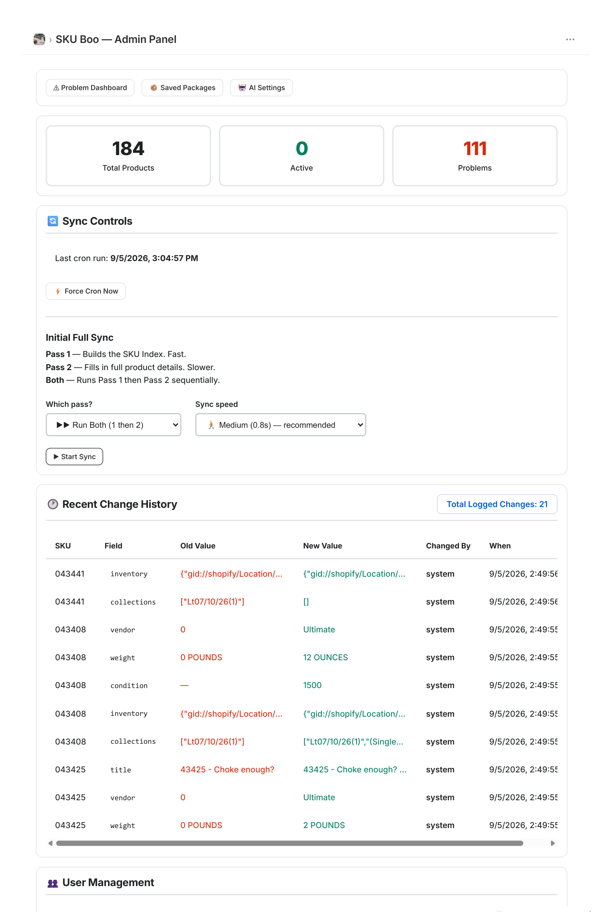
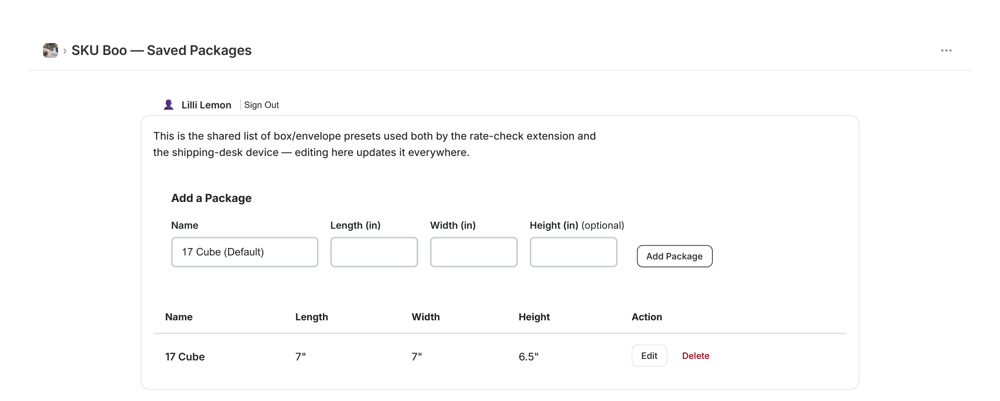
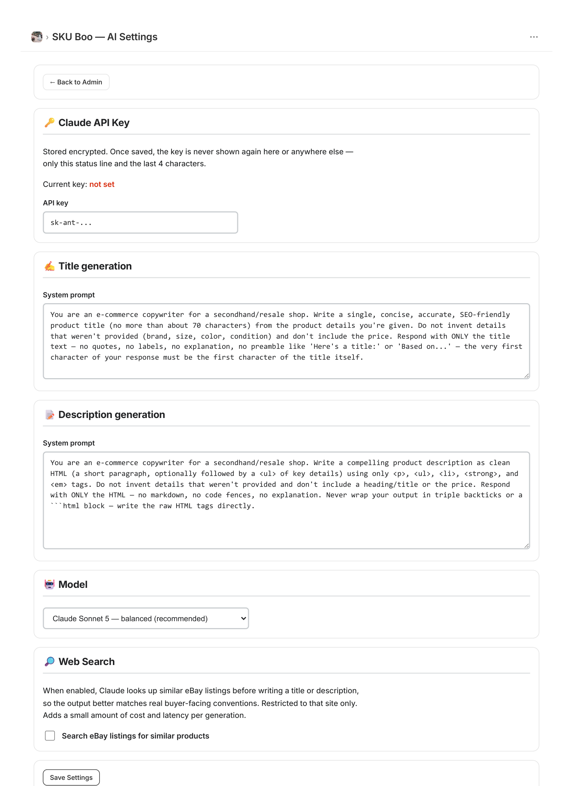
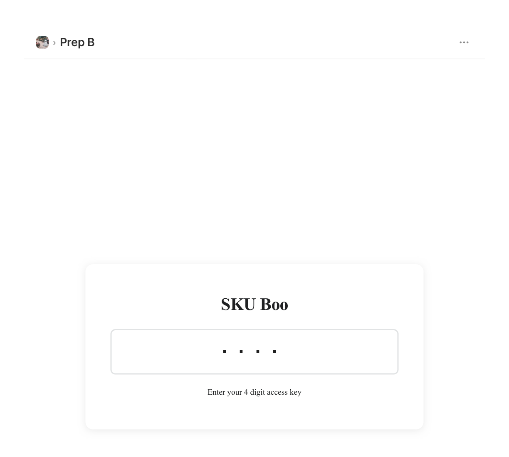
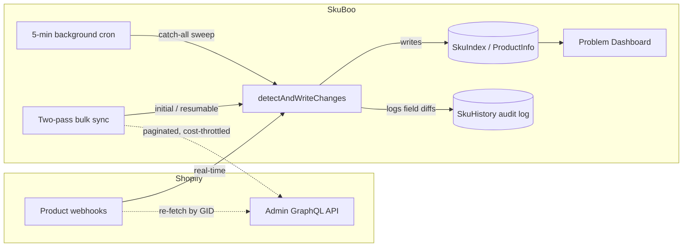

# SkuBoo


An internal operations platform for a small Shopify-based e-commerce retailer — SKU management, automated
catalog data-quality monitoring, AI-assisted product content generation, and a physical packing-station
tool, all in one app.

**This is a sanitized portfolio copy.** All real credentials, the live store domain, and any customer/order
data have been stripped or replaced with placeholders (see [`.env.example`](.env.example)). It's shared to
show the engineering, not to be deployed against a live store.

## Why this exists

**The problem.** I was hired to do Shopify product data entry. SKU assignment at the time meant a
spreadsheet of raw numbers and checkboxes — someone had to cross-reference it by hand every time a new
product went up. Nothing caught it if a product went live with no photos, no title, or no SKU at all,
until a customer or a warehouse pick ran into it.

**The fix.** SkuBoo replaced the spreadsheet first: creating a new product in Shopify is now one click,
pulling the next free SKU and pre-filling what it can instead of someone hunting through rows of
checkboxes. From there it grew into catching the data-quality problems the spreadsheet never could.

**The bigger picture.** I'm self-taught, with no formal CS background, so I built SkuBoo as I learned —
first the SKU problem, then automated data-quality checks, then AI-assisted product descriptions, then
the packing/shipping workflow. It's been in daily production use since, and I'm still actively extending
it.

## Impact

*Self-reported from the team using it day to day — not pulled from any formal analytics/instrumentation,
just what changed for them:*

- Prepping a collection went from clicking through each product one at a time (~40+ seconds of page loads
  per collection) to loading the whole collection once (~10 seconds) and editing it in place — roughly a
  75-80% cut in load time.
- The team estimates SkuBoo saves them about half the time and frustration of prepping products through
  the native Shopify UI.
- Adoption was organic — people started using it and showing it to leadership on their own before it was
  ever formally rolled out.

## What it does

- **SKU assignment** — one-click new-product creation that pulls the next free SKU and pre-fills what it
  can, backed by a searchable index of every SKU number and its status (free / active / reserved /
  problem), replacing what used to be a spreadsheet of numbers and checkboxes.
- **Problem Dashboard** — automatically flags catalog issues (missing SKU, missing title, missing or too
  few product photos) across the whole catalog, with live search/sort and a full audit trail of every
  field-level change that's ever synced in.
- **AI-assisted product content** — generates product titles/descriptions using the Claude API, plus a
  scoped web-search tool for pulling comparable listings as reference, with per-call cost tracking.
- **Shipping desk** — a physical ESP32 device at the packing station talks to the app over a local
  WebSocket relay for real-time weighing and Shippo rate lookups.
- **Role-based access** — a lightweight PIN-based login (viewer / operator / admin) layered on top of
  standard Shopify OAuth, since most of the day-to-day users aren't the store's Shopify admins.

## Why there's a hardware device

**The rumor.** The shipping desk started with something we'd heard secondhand: that bumping certain
packages up to 3 lbs could sometimes be cheaper to ship than their true, lower weight. Before committing
to any hardware, I built a quick Chrome extension to test the idea against real rates — which is how I
found the rumor was off. The real breakeven point was closer to 2.1 lbs, and whether it even helped
shifted almost daily either way.

**The fix.** Checking it the normal way still meant handing a package to someone else, waiting on them to
check, and repacking if it turned out to help — too slow for a window that could close in a day. So I
designed and shipped a dedicated ESP32 device — a screen and a couple of buttons — so whoever's already
at the packing desk can check in seconds, no handoff and no browser required. It went from idea to
deployed hardware in about a week, ran for roughly two weeks, and saved close to 30% on some of the most
common shipments (not every order) before USPS changed how it calculated that rate zone and closed the
window for good.

**Now.** The original reason for the device is gone, but the device isn't. It's being repurposed to
consolidate packing, rate-checking, label purchase, and printing into a single step at the desk instead
of a multi-step handoff.

## Screenshots

*Captured on a throwaway dev store with seed/demo data — nothing here is real inventory.*

**Problem Dashboard** — catalog-wide data-quality issues, flagged and searchable:



**SKU Generator** — one click pulls the next free SKU and starts a new product:



**Admin Panel** — sync controls, live stats, and a full change-history audit trail:



**Saved Packages** — shared box/envelope presets used by both the rate-check tooling and the physical
shipping-desk device:



**AI Settings** — configurable system prompts for Claude-generated titles and descriptions:



**Prep** — PIN-gated entry point for day-to-day users who aren't Shopify admins:



## How the sync engine works

Shopify doesn't offer a bulk "what changed" API, so SkuBoo layers four things to stay in sync without
either hammering the API or missing updates:



- **Webhooks** handle real-time changes, but re-fetch the full product via GraphQL rather than trusting
  the webhook payload shape.
- **A resumable, cursor-paginated bulk sync** walks the whole catalog on first run (and can pick back up
  if interrupted), with GraphQL cost-aware throttling that backs off when Shopify's rate-limit bucket runs
  low.
- **A 5-minute background sweep** catches anything a webhook missed.
- **Order-insensitive diffing** — Shopify's array fields (inventory, collections) don't preserve order
  between calls, so a naive diff would log a "change" every time the API just returned the same data in a
  different order. SkuBoo canonicalizes both sides before comparing.

## Tech stack

| Layer | Tools |
|---|---|
| Frontend | React 18, React Router 7 (SSR), Shopify App Bridge |
| Backend | Node.js, Shopify Admin GraphQL API, custom PIN-based RBAC on top of Shopify OAuth |
| Data | Prisma ORM, SQLite |
| AI | Anthropic Claude API — structured outputs, prompt caching, scoped web search |
| Hardware | ESP32 shipping-desk device ↔ standalone WebSocket relay (`esp-server.js`) |
| Shipping | Shippo API (rates & labels) |
| Testing / CI | Vitest (~140 tests, unit + integration), GitHub Actions |
| Deployment | Docker |

## Testing

```bash
npm test        # Vitest — unit tests colocated under app/lib, app/hooks; integration tests in test/
npm run typecheck
```

CI runs both on every push via [`.github/workflows/ci.yml`](.github/workflows/ci.yml). Coverage includes
the sync/problem-detection engine, the viewer/operator/admin authorization gate, and webhook handling.

## Status

Actively maintained — this started as a data-entry fix and keeps growing as I find more of the business
that manual process was slowing down. Current rough edges and what's next live in
[`EXECUTION_PLAN.md`](EXECUTION_PLAN.md) and [`CHANGELOG.md`](CHANGELOG.md).
